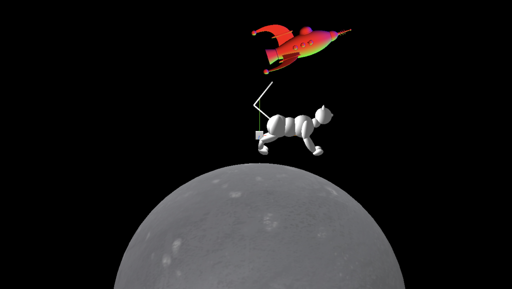

In this project, a 3D model of a cat is created using Javascript and three.js. Motion was also added to model and by clicking on certain keys (listed below), the cat model is able to kick the rocket or move across the screen. 

Keybindings:
'R' to swtich between jumping and running away from the moon
'X' to switch between jumping and kicking the rocket 

Rocket is from:
https://free3d.com/3d-model/rocket-ship-v1--579030.html

Cat reference:
https://www.google.com/url?sa=i&url=https%3A%2F%2Fwww.istockphoto.com%2Fphoto%2Fginger-cat-walks-gm1385217969-444113963&psig=AOvVaw2zUnf33oMocSS953PHmKwS&ust=1676272934108000&source=images&cd=vfe&ved=0CBAQjRxqFwoTCNCWibi5j_0CFQAAAAAdAAAAABAE

Sample screenshot:

